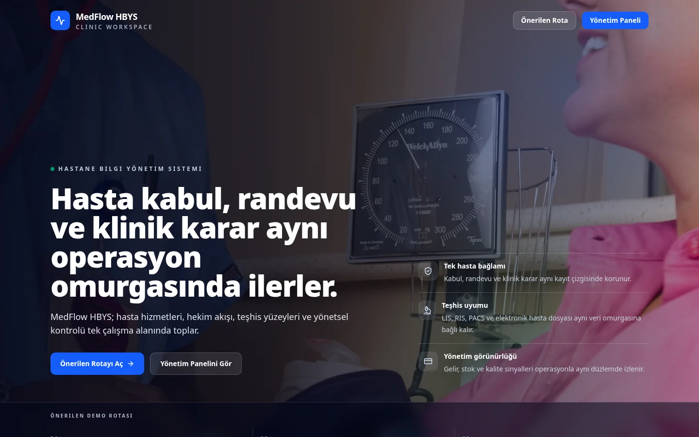
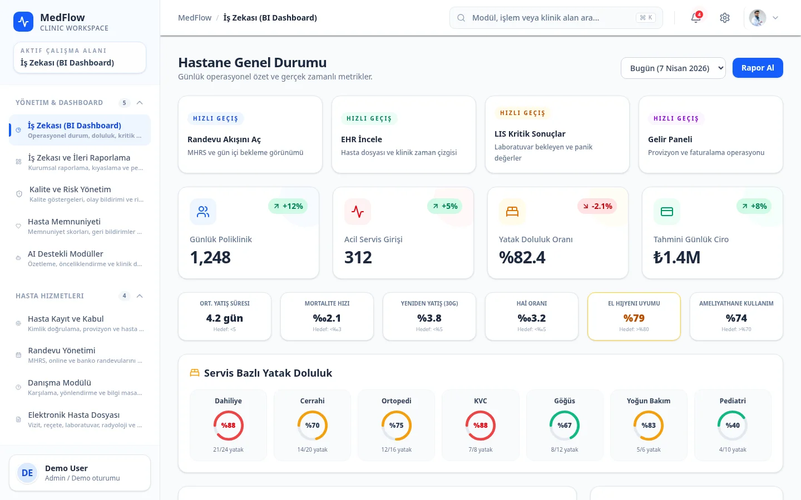
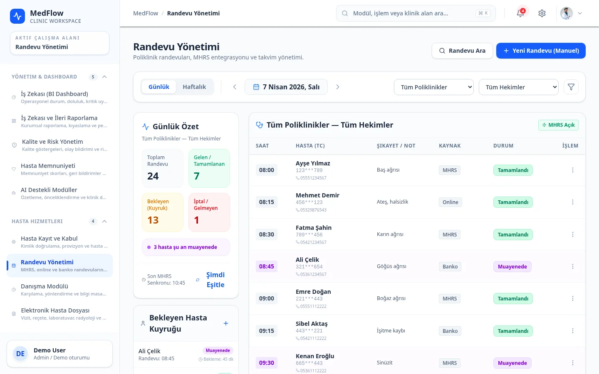
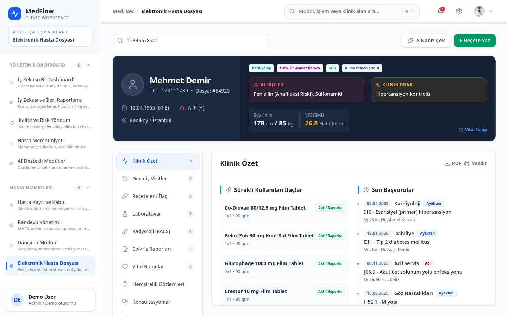
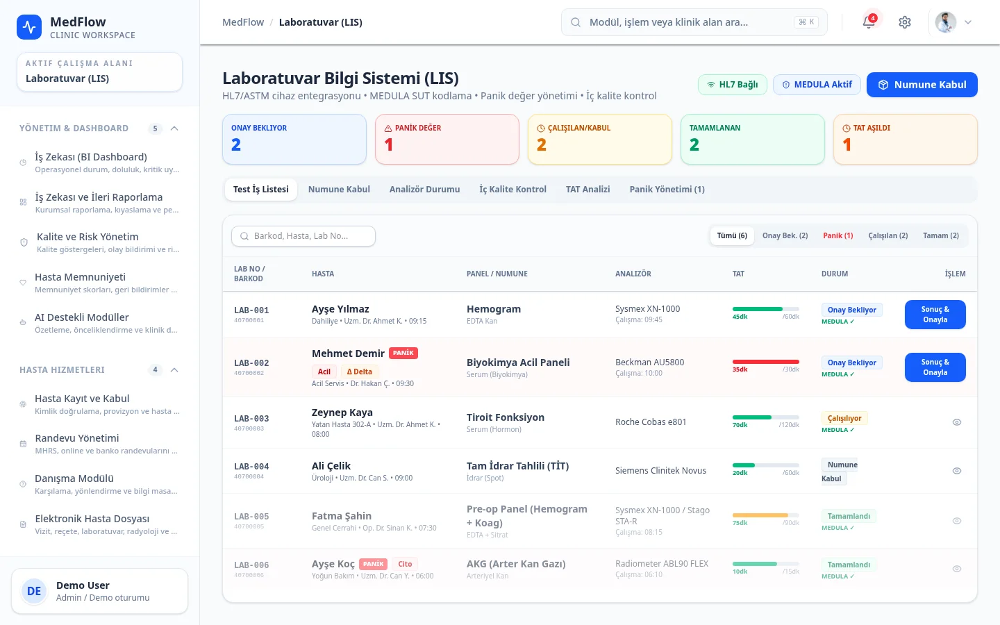
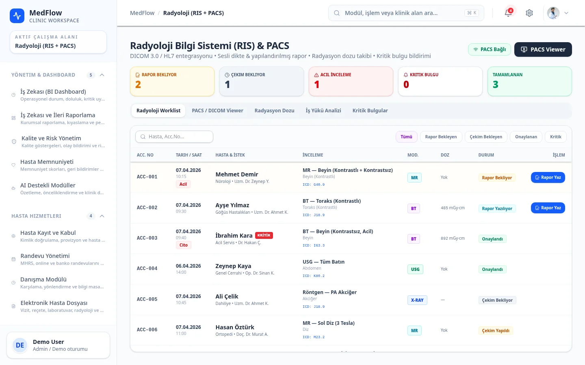
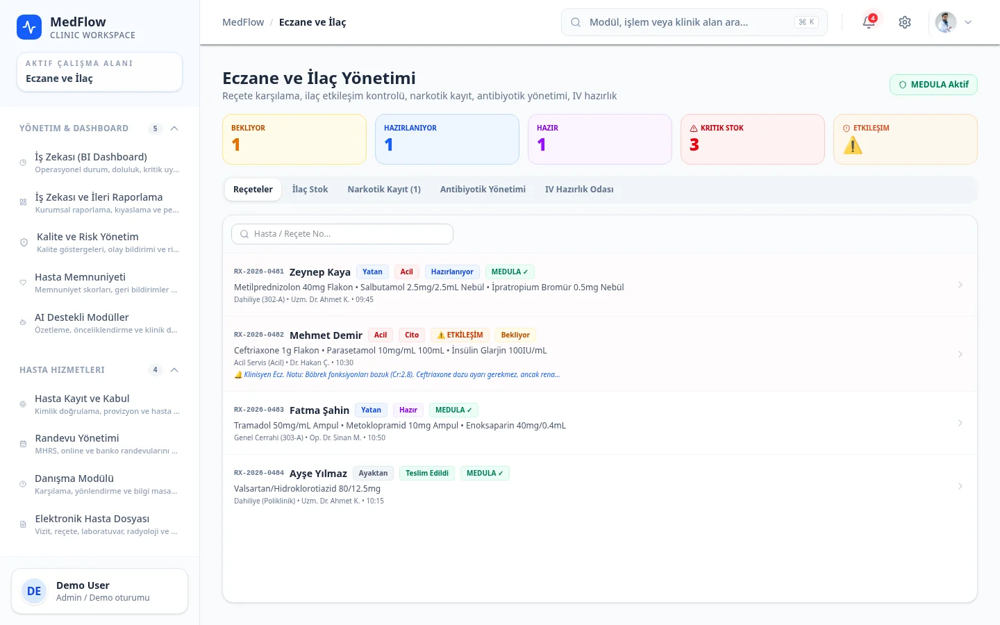
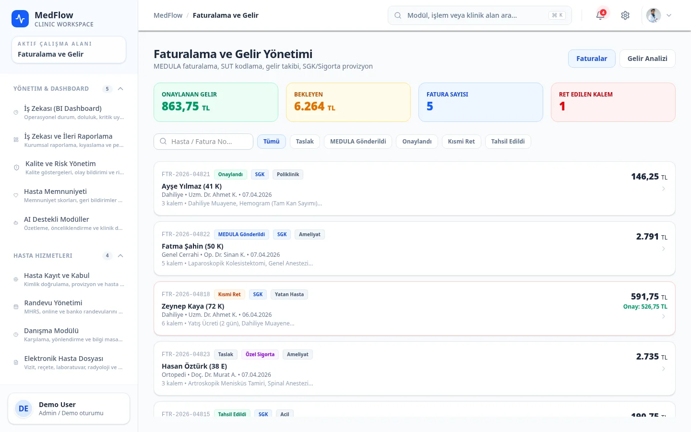

<div align="center">


# MedFlow Clinic Workspace

**Bütüncül klinik yönetim demosu** — hasta dosyası, randevu, EMR, lab, radyoloji, eczane, faturalama ve raporlama tek dense panelde. Küçük-orta ölçekli klinikler için modern HBYS arayüzü modeli.

[](#tech-stack)
[](https://clinic.lavescar.com.tr)
[](#license)

[**▸ Live demo**](https://clinic.lavescar.com.tr) · [**▸ Portfolyo**](https://lavescar.com.tr) · [**▸ Diğer demolar**](https://lavescar.com.tr/#projects)

</div>

---

<p align="center"></p>

## Genel bakış

MedFlow, küçük poliklinik ve özel muayenehanelerin Excel + WhatsApp + ayrı ayrı sistemler dağılımından çıkıp tek tutarlı bir panelde çalışmasına yönelik tasarlandı. Frontend tamamen statik bir SPA — gerçek bir backend bağlanmadan da çalışır (mock veri ile demo deneyimi sunar). Production'da Cloudflare Pages'e deploy edilir, gerçek klinikte FHIR-uyumlu bir backend ile beslenebilir.

## Modüller

| Modül | İçerik |
|---|---|
| **Dashboard** | Günlük randevu, hasta sayısı, bekleyen lab sonuçları, gelir KPI'ları |
| **Hasta dosyası (EMR)** | Demografik bilgi, alerji, ilaç listesi, geçmiş, dokümanlar |
| **Randevu** | Drag-drop takvim, doktor müsaitliği, online randevu kaynağı |
| **Lab** | Test panelleri, sonuç akışı, kritik değer alarmı |
| **Radyoloji** | Görüntüleme talebi, DICOM viewer placeholder, rapor şablonu |
| **Eczane** | İlaç stoğu, prescription history, etkileşim uyarısı |
| **Fatura** | SGK + özel sigorta + cepten ödeme; aylık dönem raporu |
| **Personel** | Vardiya, izin takibi, rol yetki matrisi |
| **Envanter** | Sarf malzeme, kritik stok eşiği |
| **Sevk** | Diğer klinik/hastane sevki, dış doktor eşleşmesi |

## Tech stack

| Layer | Technology |
|---|---|
| Frontend | React 18 + TypeScript + Vite |
| UI primitives | Radix UI (28 ayrı paket) |
| Styling | Tailwind CSS |
| Icons | Lucide React |
| Routing | React Router (browser paths) |
| Form/state | shadcn-style local component state (server-state hook'ları placeholder) |
| Deploy | Cloudflare Pages (`adapter-static` benzeri SPA fallback) |

## Ekran görüntüleri

<table>
  <tr>
    <td></td>
    <td></td>
  </tr>
  <tr>
    <td></td>
    <td></td>
  </tr>
  <tr>
    <td></td>
    <td></td>
  </tr>
  <tr>
    <td colspan="2"></td>
  </tr>
</table>

## Hızlı başlangıç

```bash
git clone https://github.com/Lavescar-dev/medflow.git
cd medflow

npm install
npm run dev
```

Tarayıcıda `http://localhost:5173` açılır. Build:

```bash
npm run build       # Statik bundle → dist/
npm run check       # tsc --noEmit (app + node configs)
```

## Routing & static hosting

MedFlow tarayıcı path'leri kullanır:

- `/dashboard`
- `/appointments`
- `/patient-registration`
- `/ehr`
- `/lab`, `/radiology`, `/pharmacy`, `/billing`, `/staff`, `/inventory`, `/referrals`, `/reports`

Statik host'lar için iki SPA fallback katmanı:

- `public/_redirects` — Cloudflare Pages, Netlify gibi redirect-rule destekleyen host'lar
- `dist/404.html` — `404.html` fallback'e düşen host'lar (build sırasında otomatik kopyalanır)

## Deploy

Cloudflare Pages için doğrudan repo bağlanır:

| Field | Value |
|---|---|
| Build command | `npm run build` |
| Build output directory | `dist` |
| Node version | `20` |

## License

MIT © 2026 Lavescar

---

<sub>Built by **[Lavescar](https://lavescar.com.tr)** · [Portfolyo](https://lavescar.com.tr/#projects) · [efe@lavescar.com.tr](mailto:efe@lavescar.com.tr)</sub>
